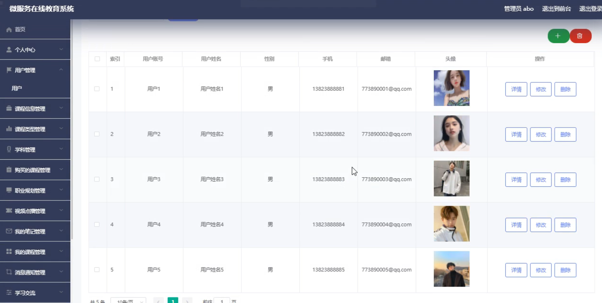
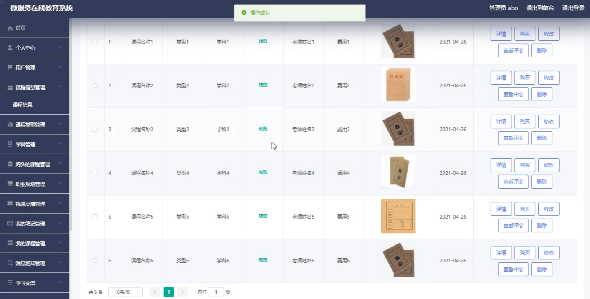
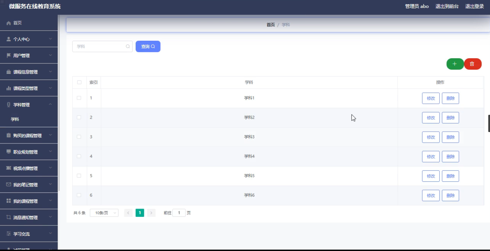
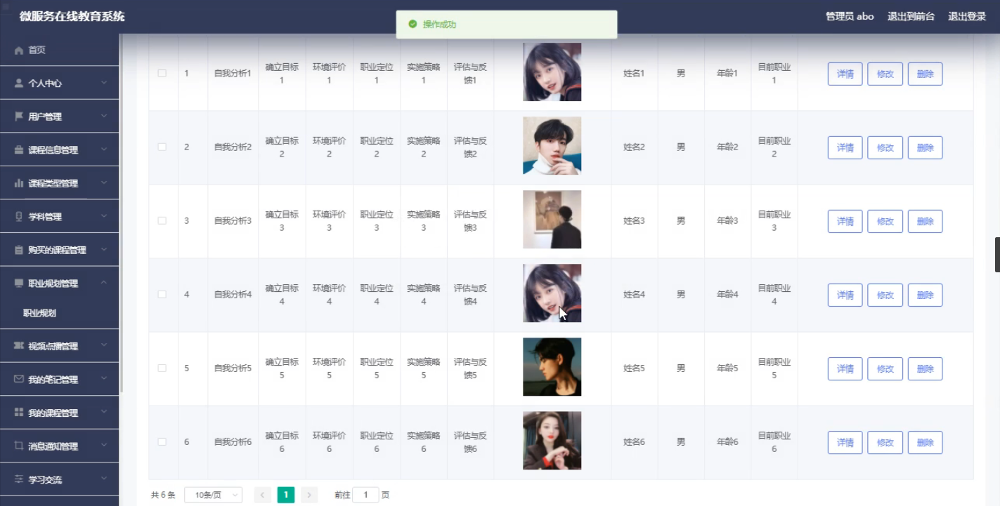
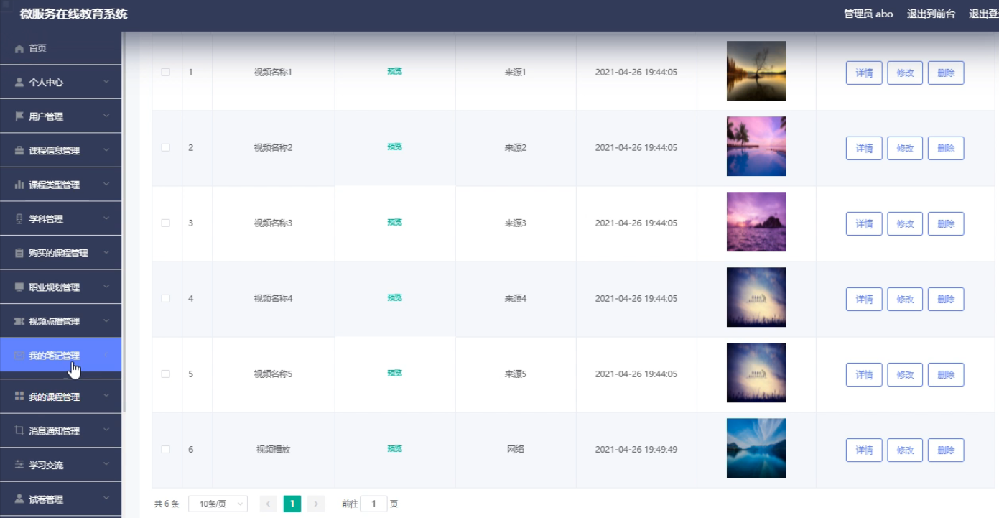

**项目简介：**  
本项目基于主流的前后端分离架构，采用 **SpringBoot + Vue 技术栈**，配套 **MySQL 数据库**，适用于毕业设计与课题实训开发。  
本人已整理了超 **4000 多套毕业设计源码+论文+开题报告+PPT...**，涵盖 **Java、SpringBoot、Vue、SSM、uni-app 小程序、PHP、Android** 等方向，支持功能修改定制与论文服务。  
**团队提供以下服务：**  
- 项目代码修改与调试  
- 数据库配置与远程协助  
- 论文定制与修改  
**获取更多的4000多套源码或SQL文件请联系：**  
- QQ：3906443360 微信：BesheHelp

# springboot049在线教育系统设计与实现

（1）课程信息的实体属性图如下：

图4.12  课程信息实体属性图

（2）教育资讯信息实体属性图如图4.13所示：

图4.13  教育资讯信息实体属性图

（3）留言板信息实体属性图如图4.14所示：

图4.14 留言板信息实体属性图

4.3.2数据库设计表

微服务在线教育系统需要后台数据库，下面介绍数据库中的各个表的详细信息：

表4.1 客户服务

表4.2 课程信息评论表

表4.3 试卷表

表4.4 试题表

表4.5 考试记录表

表4.6 学习交流

表4.7 购买的课程

表4.8 课程类型

表4.9 课程信息

表4.10 留言板

表4.11 教育资讯

表4.12 视频点播

表4.13 收藏表

表4.14 管理员表

表4.15 我的笔记

表4.16 我的课程

表4.17 消息通知

表4.18 学科

表4.19 用户

表4.20 职业规划

5系统详细实现

5..1 用户管理

微服务在线教育系统的系统管理员可以管理用户，可以对用户信息添加修改删除以及查询操作。具体界面的展示如图5.1所示。

图5.1 用户信息管理界面

5.2 课程信息管理

系统管理员可以查看对课程信息信息进行添加，修改，删除以及查询操作。具体界面如图5.2所示。

图5.2 课程信息信息管理界面

5.3 学科管理

管理员可以对学科信息进行修改，删除以及查询操作。界面如下图所示：

图5.3 学科信息管理界面

5.4 职业规划管理

管理员可以对职业规划信息进行修改操作，还可以对职业规划信息进行查询。界面如下图所示：

图5.4 职业规划管理界面

5.5 我的笔记管理

管理员可以对我的笔记信息进行查看，修改，删除操作。界面如下图所示：

图5.5 我的笔记界面